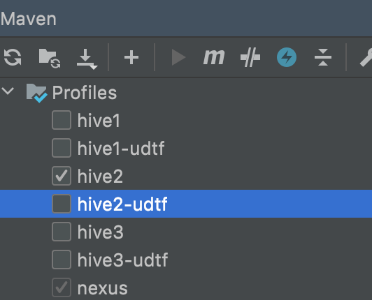

# MaxCompute Migration Assistant
MaxCompute Migration Assistant (MMA) provides a solution to migrate data from different datasources to MaxCompute.

Currently, the following scenario are supported:

.Hive to MaxCompute
.MaxCompute to MaxCompute


# 代码目录
## mma-server
mma的主程序

## mma-common
mma-server与其他模块共同使用的代码

## mma-source
迁移的数据源相关代码

## mma-ui
操作界面代码

# 构建
## 要求
jdk >= 1.8

## 方法
编译适用于hive2, hive3的版本
```shell
./build 2
```
编译适用于hive1的版本
```shell
./build 1
```

用于迁移数据的hive udtf代码位于mma-source/hive/hive-udtf，udtf的jar包已经编译好放入mma-server的resource里了，
启动mma-server后，可以在"帮助"页面下载。如果需要单独编译hive udtf, 可以直接运行
```shell
mvn package -Dhive=x # x可以为1，2，3中的一个
```

# 运行
1. cd mma-server/target
2. java -jar mma-server.jar -c  /xx/xx/config.ini
3. config.ini 内容示例如下

```INIT
[mysql]
host = 127.0.0.1
port = 3306
db = xxx
username = xxx
password = xxx

[mma]
listening_port: 6060
```

# 使用docker运行
1. copy mma-server/target/MMAV3.jar docker/
2. 修改config.ini里面的password和docker-compose.yml里的"MYSQL_ROOT_PASSWORD", 注意保持两者一致
3. cd docker
4. docker build -t mma:v3 .
5. docker-compose up


# 使用文档
[使用文档](mma-ui/public/MMAv3-manual.pdf)
 
# 开发注意事项
1. mac本地开发的时候需要将hostname值写入/etc/networks，否则每次启动程序会慢5s左右
2. 用intelli的时候，需要选一下maven的profiles, 比如


3. 注意修改一下mma-source/hive/pom.xml里的${hive.version}值，否则用ide启动mma-server时会报错